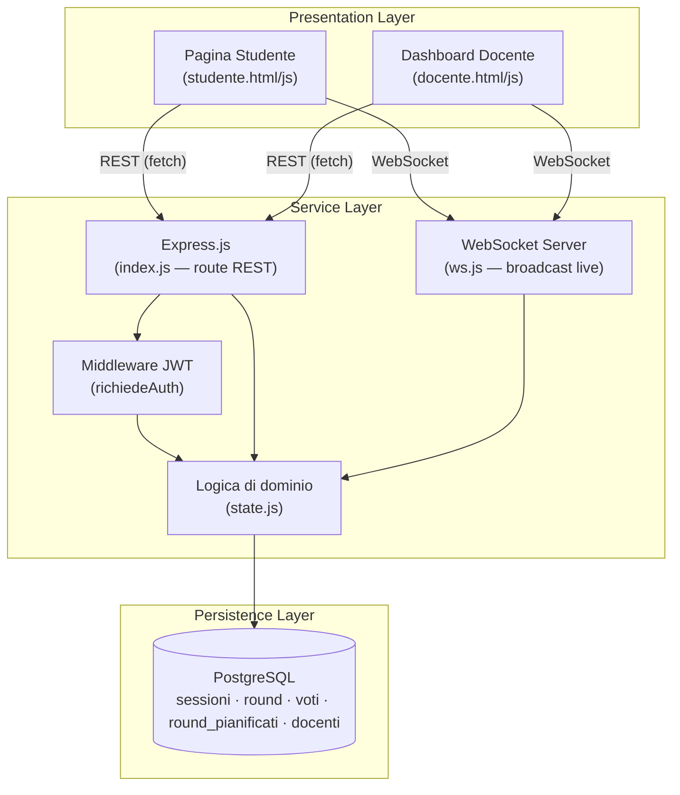

# Architettura di AulaCheck

Architettura a tre livelli (Presentation / Service / Persistence), con canale WebSocket parallelo per gli aggiornamenti in tempo reale.

## Note architetturali

- **SPA (Single Page Application)**: ogni pagina (`studente.html`, `docente.html`) è un'unica pagina HTML; JavaScript aggiorna il DOM dinamicamente senza mai ricaricare.
- **Separazione delle responsabilità**: il livello di presentazione non contiene logica di business; comunica solo via REST/WebSocket con il backend.
- **Stato in memoria**: solo i timer dei round (`setTimeout`) vivono in memoria nel processo Node — sono comportamento a runtime, non dati persistenti. Tutto il resto (sessioni, round, voti) vive in PostgreSQL.